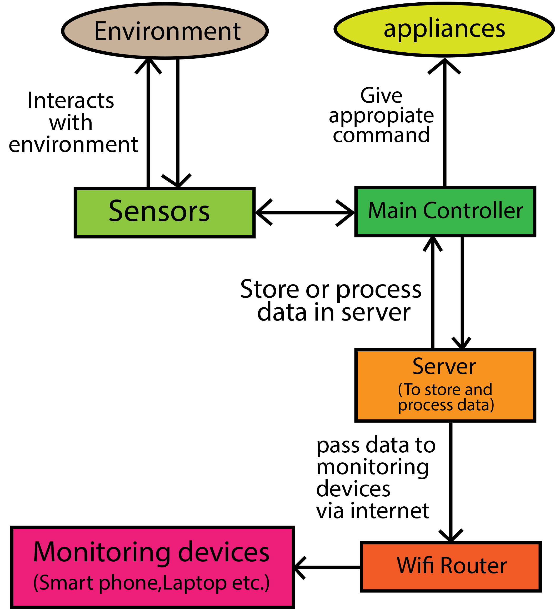

# HomeAutomation
 A smart home monitoring system. (2019) For this project we've been selected for 1st runner up.

 This project was made for our Computer Networks Laboratory project. Here we try to make a smart home monitoring system which can be controlled through our smart devices. 
 We also create a mobile app using MIT App Inventor. That can control our smart home. Data is stored and processed in the data server (firebase) and then sent back to the controller again for any changes or taking action. 
 

 ## Project description
Name: HomeAutomation  
Programming Language: C/C++  
Platform: Arduino  
Project No: Update me  
Year: 2019

## Parts use
<ul>
  <li>Arduino Uno</li>
  <li>NodeMCU</li>
  <li>Relay module</li>
  <li>LDR</li>
  <li>Temperature sensor</li>
  <li>Motor(fan)</li>
  <li>12V pump</li>
  <li>LED lights</li>
  <li>12V to 3V converter</li>
  <li>5V Power Supply</li>
  <li>DC Jack</li>
  <li>Wires</li>
</ul>

## Demo Video
<!--  -->

## Certificate

## Working Mechanism & Circuit

## Screen shot

## App demo

## Apk file
* **[chemical reaction](app/SmartHome.apk)**

## Authors

* **AbirHasan**

Check out my other works [@XAbirHasan](https://github.com/XAbirHasan)